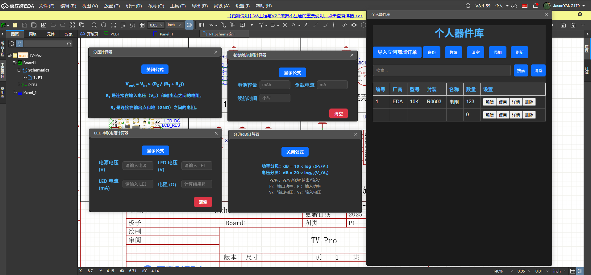
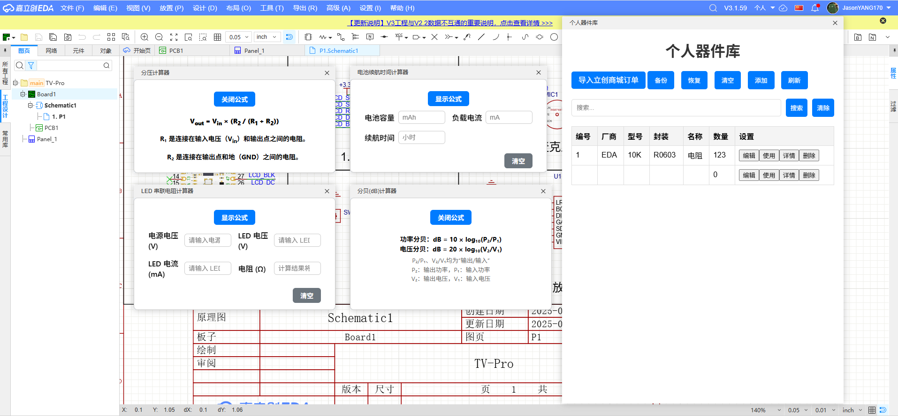
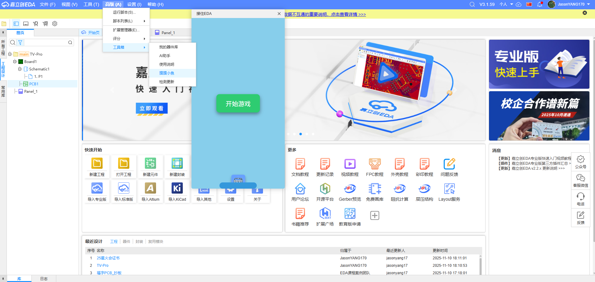
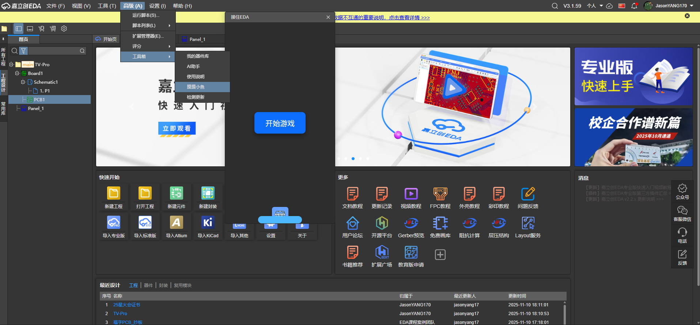

## Tool-Box工具箱

## 功能

### 原理图

-   ✅555定时计算器
-   ✅LM317电压计算器
-   ✅电池续航计算器
-   ✅电容串/并联计算器
-   ✅电阻串/并联计算器
-   ✅分压电路计算器
-   ✅LED串联电阻计算器
-   ✅欧姆定律计算器
-   ✅三极管放大倍数计算器
-   ✅RC滤波器计算器
-   ✅分贝（dB）计算器
-   ✅RC时间常数计算器

### PCB

-   ✅色环计算器（支持鼠标点击电阻器件自动生成色环颜色）
-   ✅电流线宽计算器（支持鼠标点击走线自动修改）
-   ✅微带线阻抗计算器
-   ✅过孔计算器
-   ✅信号完整性计算器
-   ✅热管理/散热能力计算器

### 个人器件库

-   ✅支持从立创商城导入订单
-   ✅支持相同器件数量累计
-   ✅支持自定义编辑器件
-   ✅支持器件库存计数
-   ✅支持备份器件数据
-   ✅支持导入器件数据
-   ✅支持模糊搜索器件

### 其他功能

-   ✅Game-接住EDA
-   ✅支持OllamaAPI本地AI分析及答疑

如果你有更好的建议，请向我提出Issues  
[GitHub issues](https://github.com/JasonYANG170/EDA-Toolbox/issues)

## PR

如果你有更好的想法，欢迎PR，让我们共建好用的EDA工具箱

## 实物图

| 1                            | 2                              |
| ---------------------------- | ------------------------------ |
|  |    |
|    |  |
