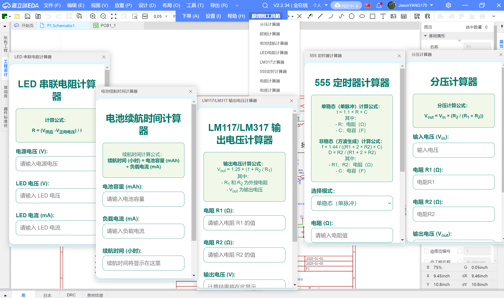
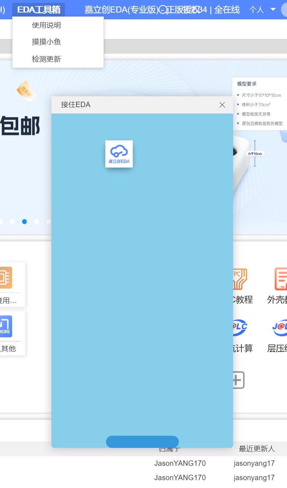
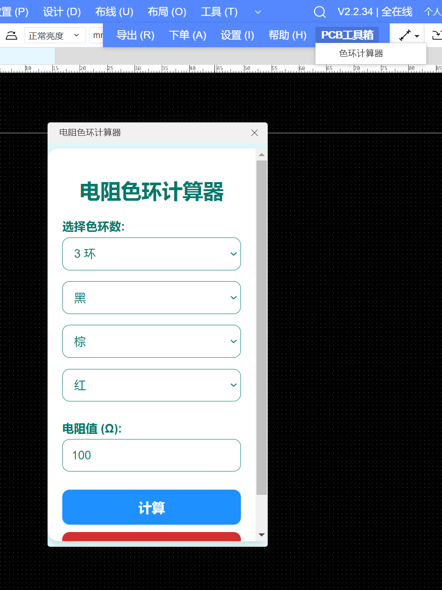

    <h1>EDA-Toolbox</h1>

这是一项嘉立创EDA&EasyEDA的插件

## 功能
### 原理图
- ✅555定时计算器
- ✅LM317电压计算器
- ✅电池续航计算器
- ✅电容串/并联计算器
- ✅电阻串/并联计算器
- ✅分压电路计算器
- ✅LED串联电阻计算器
- ✅欧姆定律计算器
### PCB
- ✅色环计算器 (支持鼠标点击电阻器件自动生成)
- ✅电流线宽计算器 (支持鼠标点击走线自动修改)
### 其他
- ✅Game_接住EDA
- ✅我的器件库 (支持管理自己当前持有的器件库存和快速索引)

如果你有更好的建议，请向我提出Issues

## PR
如果你有更好的想法，欢迎PR，让我们共建好用的EDA工具箱

## 喜欢这个项目，请为我点个Star ⭐

## 实物图

| 1 | 2 |
| --- | --- |
| ||
|  |  |
| ||
