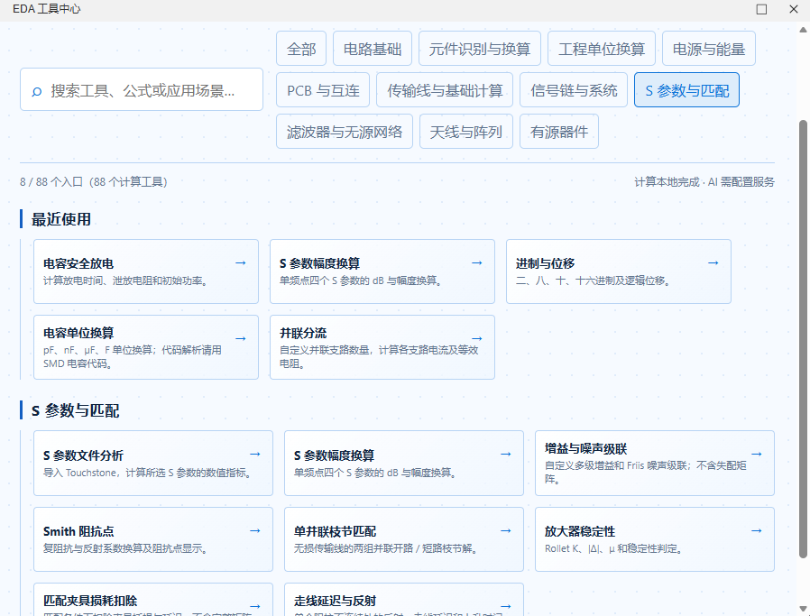
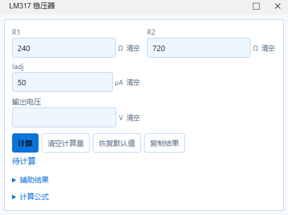
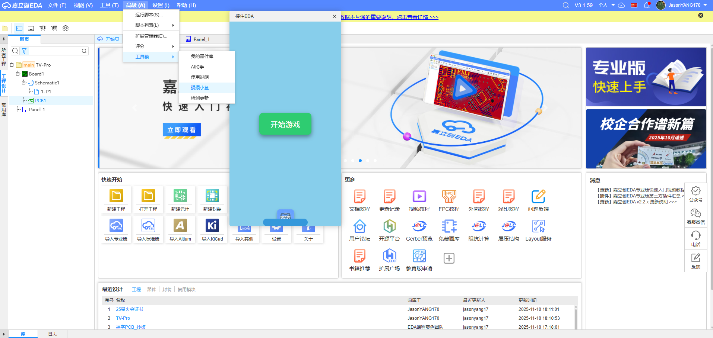
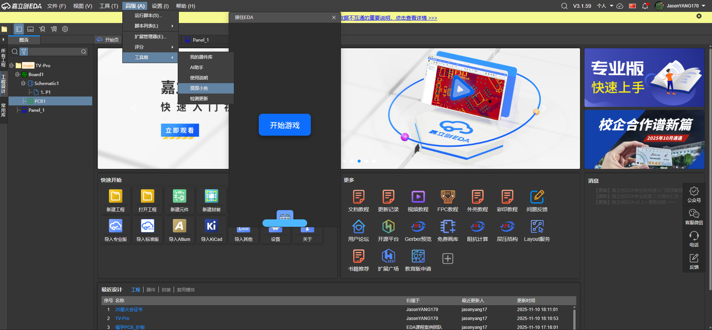

## Tool-Box工具箱

## 功能

## 实物图

| 1                            | 2                              |
| ---------------------------- | ------------------------------ |
|  |    |
|    |  |

### 电路基础

-   ✅分压计算器
-   ✅欧姆定律
-   ✅LED 串联电阻
-   ✅555 定时器
-   ✅串并联电阻（支持自定义元件数量与多级串并联子组，可留空反算）
-   ✅串并联电容（支持自定义元件数量与多级串并联子组，可留空反算）
-   ✅RC 时间常数
-   ✅并联分流（支持自定义支路数量）
-   ✅电抗与导纳

### 元件识别与换算

-   ✅4 / 5 / 6 环电阻（支持鼠标点击电阻器件自动生成色环颜色）
-   ✅电容单位换算
-   ✅电感单位换算
-   ✅SMD 电容代码
-   ✅SMD 电阻代码（3 位、4 位、R 标记、EIA-96）

### 工程单位换算

-   ✅小数转分数
-   ✅能量换算
-   ✅力单位换算
-   ✅长度换算
-   ✅进制与位移
-   ✅压力换算
-   ✅温度换算
-   ✅体积换算
-   ✅质量换算

### 电源与能量

-   ✅电池续航
-   ✅LM317 稳压器
-   ✅电容安全放电
-   ✅三相功率

### PCB 与互连

-   ✅PCB 走线载流（支持鼠标点击走线自动修改）
-   ✅PCB 过孔载流
-   ✅PCB 热管理
-   ✅AWG 线径

### 传输线与基础计算

-   ✅微带线
-   ✅带状线
-   ✅同轴线
-   ✅CPW / CPWG
-   ✅差分对
-   ✅矩形波导
-   ✅双线传输线
-   ✅过孔寄生参数
-   ✅趋肤深度
-   ✅传输线输入阻抗

### 信号链与系统

-   ✅接收链设计（支持自定义级数）
-   ✅自由空间路径损耗
-   ✅射频链路预算
-   ✅雷达作用距离
-   ✅混频杂散表
-   ✅ADC 采样与混叠
-   ✅射频单位换算
-   ✅dB / 功率换算
-   ✅VSWR / 回波损耗
-   ✅复反射系数

### S 参数与匹配

-   ✅S 参数文件分析（导入 Touchstone）
-   ✅S 参数幅度换算
-   ✅增益与噪声级联（支持自定义级数）
-   ✅Smith 阻抗点
-   ✅单并联枝节匹配
-   ✅放大器稳定性
-   ✅匹配夹具损耗扣除
-   ✅走线延迟与反射

### 滤波器与无源网络

-   ✅RC / RL / LC 滤波器
-   ✅Butterworth 低通原型
-   ✅衰减器设计
-   ✅LC 谐振器
-   ✅Wilkinson 功分器
-   ✅耦合线初步设计
-   ✅非理想 R/L/C 与 SRF
-   ✅阻抗匹配网络
-   ✅Bias Tee 设计
-   ✅巴伦与变压器
-   ✅阶梯阻抗低通
-   ✅耦合线带通
-   ✅双工器设计

### 天线与阵列

-   ✅偶极子 / 单极子
-   ✅微带贴片天线
-   ✅八木尺寸估算
-   ✅矩形口径喇叭
-   ✅抛物面天线
-   ✅均匀线阵估算
-   ✅均匀线阵 ULA
-   ✅轴向模螺旋天线
-   ✅天线单元参数

### 有源器件

-   ✅晶体管增益与偏置
-   ✅晶体管偏置设计（BJT / FET）
-   ✅PA 效率与工作类
-   ✅VCO 与振荡器
-   ✅混频器设计
-   ✅AGC / VGA
-   ✅LNA 噪声匹配

### 个人器件库

-   ✅支持从立创商城导入订单
-   ✅支持相同器件数量累计
-   ✅支持自定义编辑器件
-   ✅支持器件库存计数
-   ✅支持备份器件数据
-   ✅支持导入器件数据
-   ✅支持模糊搜索器件

### 其他功能

-   ✅Game-接住EDA
-   ✅支持OllamaAPI本地AI分析及答疑
-   ✅跟随系统设置切换深浅色
-   ✅计算结果原位展示，辅助结果可勾选“作为已知量”参与反算
-   ✅关闭工具窗口自动返回工具中心

如果你有更好的建议，请向我提出Issues
[GitHub issues](https://github.com/JasonYANG170/EDA-Toolbox/issues)

## PR

如果你有更好的想法，欢迎PR，让我们共建好用的EDA工具箱
